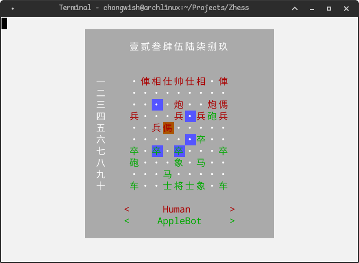
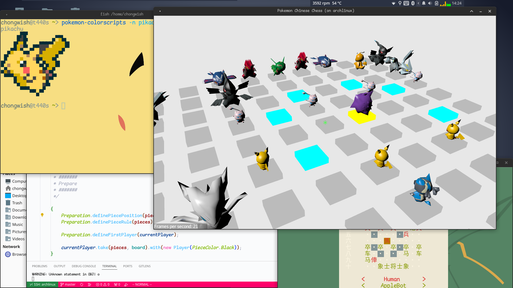

# Zhess

> 有约不来 过夜半，闲敲棋子 落灯花

A chess framework and some chess game here.

### Target:

- How to play a chess
- How does a chess program work
- How to design/make a chess game
- How does the algorithm to win a chess game
- How to write a tui/3d game
- I can play chess on linux
- ... ...

### Structure

#### Subprojects

```
├── appearance
│   ├── pokemon     // a 3d pokemon looks
│   └── text        // a tui looks
├── bot             // some algorithm & model for making bot
├── game
│   ├── classic     // classic chinese chess game core
│   └── dark        // chinese dark chess game core
└── stuff           // read & virtual & imagination materials
```

### Screenshot

#### text

Chinese chess with tui:



#### pokemon

3D pokemon chinese chess:


